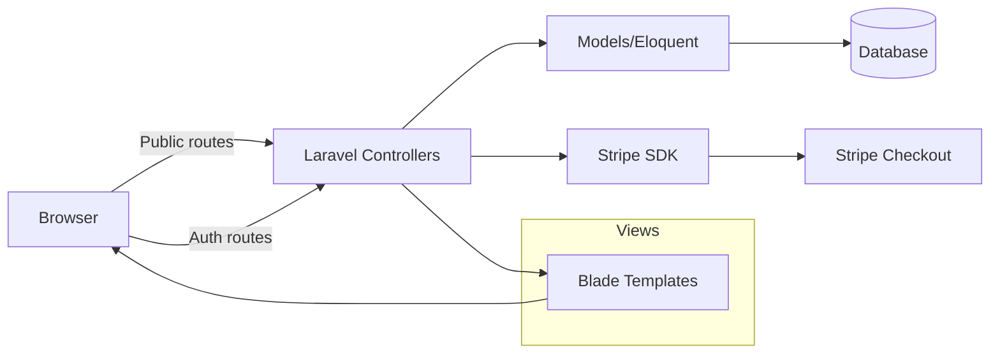
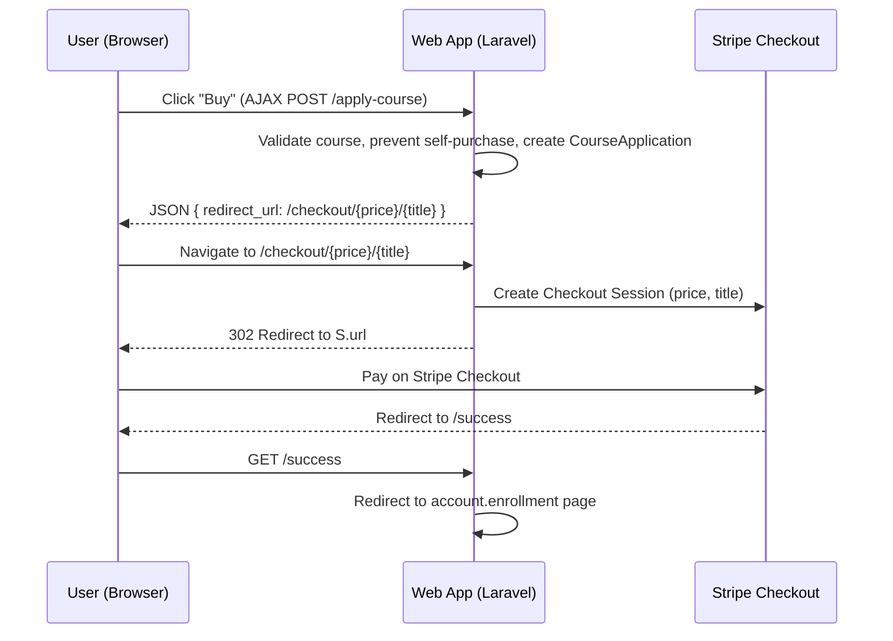

## Course Sell Website

A Laravel 11 application for publishing, browsing, saving, and purchasing courses using Stripe Checkout. Includes public pages, authenticated account flows for learners and publishers, and an admin panel for managing users, courses, and enrollments.

### Key Features
- Public homepage with categories, featured and latest courses
- Search and filter courses by keyword and category
- Course detail with Save and Buy actions
- Auth flows: register, login, logout, password reset via email
- Profile management: update profile, change password, update profile picture (with thumbnail)
- Create, edit, list, delete own courses
- View enrollments and saved courses
- Admin panel: manage users, approve publisher requests, manage courses and enrollments
- Stripe Checkout payment integration

### Tech Stack
- Laravel 11, PHP 8.2
- MySQL or PostgreSQL (any Laravel-supported SQL DB)
- Stripe PHP SDK
- Intervention Image (profile pic processing)
- Bootstrap 5, jQuery; Vite 5 for asset tooling

---

## Getting Started

### Prerequisites
- PHP 8.2+
- Composer
- A SQL database (e.g., MySQL)
- Node.js 18+ (optional, for Vite dev server)

### Installation
```bash
composer install
cp .env.example .env
php artisan key:generate

# Configure your database in .env, then:
php artisan migrate

# (Optional) install frontend tooling
npm install
npm run dev
```

### Environment Variables
Add these to your `.env`:
```env
# App
APP_NAME="Course Sell"
APP_ENV=local
APP_KEY=base64:...
APP_URL=http://localhost

# Database
DB_CONNECTION=mysql
DB_HOST=127.0.0.1
DB_PORT=3306
DB_DATABASE=your_db
DB_USERNAME=your_user
DB_PASSWORD=your_pass

# Stripe
STRIPE_SK=sk_test_xxx
STRIPE_PK=pk_test_xxx
```

### Run
```bash
php artisan serve
# Visit http://127.0.0.1:8000
```

---

## Architecture Overview



### Core Modules
- Controllers: `HomeController`, `CourseController`, `AccountController`, `admin/*`
- Models: `User`, `Course`, `Category`, `CourseApplication`, `SavedCourse`
- Middleware: `auth`, `CheckAdmin` (admin-only), `redirectAuthenticated` (login/register guard)
- Views: `resources/views/front/*`, `resources/views/admin/*`, `resources/views/layouts/app.blade.php`

---

## Payment Sequence (Enroll/Buy Course)



Note: For stronger integrity, prefer server-side lookup by `course_id` when creating the Stripe session (avoid trusting client price/title), and convert price to smallest currency unit (e.g., cents).

---

## Database (ERD)

```mermaid
erDiagram
  USERS ||--o{ COURSES : publishes
  USERS ||--o{ COURSE_APPLICATIONS : enrolls
  USERS ||--o{ SAVED_COURSES : saves

  CATEGORIES ||--o{ COURSES : categorizes

  COURSES ||--o{ COURSE_APPLICATIONS : has
  COURSES ||--o{ SAVED_COURSES : has

  USERS {
    int id PK
    string name
    string email UNIQUE
    string password
    string image
    string designation
    string mobile
    string role
    int changeRole
  }

  CATEGORIES {
    int id PK
    string name
    int status
  }

  COURSES {
    int id PK
    string title
    int category_id FK
    int user_id FK
    string author
    string price
    int seat
    string duration
    string description
    string benefits
    string prerequisite
    string link
    string keywords
    string experience
    int status
    int isFeatured
  }

  COURSE_APPLICATIONS {
    int id PK
    int course_id FK
    int user_id FK
    int t_id FK
    datetime applied_date
  }

  SAVED_COURSES {
    int id PK
    int course_id FK
    int user_id FK
  }
```

---

## Routes Overview (Selected)

Public
- `GET /` → Home (categories, featured, latest)
- `GET /courses` → Course list with filters
- `GET /courses/detail/{id}` → Course detail
- `POST /apply-course` → Enroll then redirect to checkout (AJAX)
- `POST /save-course` → Save course (AJAX)

Auth/Account
- `GET /account/login`, `POST /account/auth`, `GET /account/register`
- `GET /account/profile`, `PUT /account/update-profile`
- `POST /account/update-password`, `POST /account/update-profile-pic`
- `GET /account/create-course`, `POST /account/save-Course`
- `GET /account/my-courses`, `GET /account/my-courses/edit/{id}`, `POST /account/update-course/{id}`
- `GET /account/enrollments`, `POST /remove-enrollments`
- `GET /saved-courses`, `POST /remove-saved-applications`

Admin (protected by `checkRole`)
- `GET /admin/dashboard`
- `GET /admin/users`, `GET /admin/users/{id}`, `PUT /admin/users/{id}`
- `GET /admin/courses`, `GET /admin/courses/edit/{id}`, `PUT /admin/courses/update/{id}`
- `GET /admin/enrollments`, `POST /admin/enrollments/delete`

Stripe
- `ANY /checkout/{price}/{title}` → Create Stripe Checkout Session
- `GET /success` → Redirect to enrollments page

Middleware
- `auth`, `CheckAdmin`, `redirectAuthenticated`

---

## Project Structure (excerpt)
```text
app/
  Http/Controllers/* (Home, Course, Account, Stripe, Admin controllers)
  Http/Middleware/CheckAdmin.php
  Models/* (User, Course, Category, CourseApplication, SavedCourse)
resources/views/
  layouts/app.blade.php
  front/* (home, jobs, jobDetail, account/*)
  admin/* (dashboard, users, courses, enrollments)
routes/web.php
config/stripe.php
public/assets/* (css, js, images)
```

---

## Stripe Configuration Notes
- Set `STRIPE_SK` and `STRIPE_PK` in `.env` and `config/stripe.php` consumes them.
- Ensure price is sent to Stripe in smallest currency unit (e.g., cents). If prices are stored as dollars, multiply by 100 when creating a session.
- Prefer server-side lookup for price/title by `course_id` to avoid tampering.

---

## Troubleshooting
- 404 on admin routes: ensure your user has `role='admin'` (and you’re authenticated)
- Profile picture not updating: check `public/profile_pic` and `public/profile_pic/thumb` permissions
- Stripe redirect loop: verify `success_url` domain matches your dev URL
- Emails not sending: configure a proper mailer in `.env` (Mailtrap, SMTP)

---

## Contributing
Pull requests are welcome. For major changes, please open an issue first to discuss what you’d like to change.

## License
MIT


